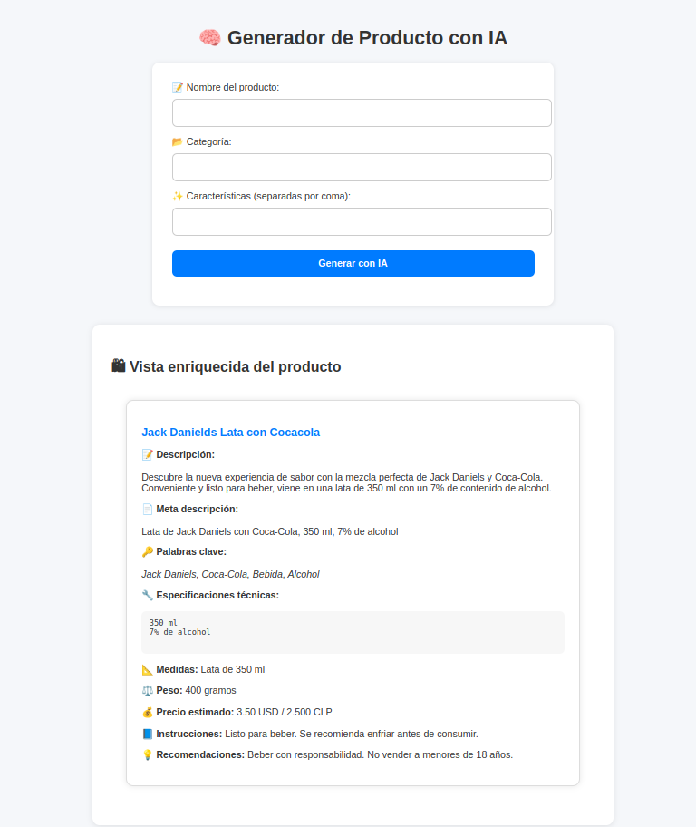

# 🧠 AI Catalog - Product Sheet Generator with Artificial Intelligence

This project uses **OpenAI GPT-4** and AI-generated images to enrich product catalogs with descriptions, benefits, specifications, colors, estimated prices, and more.

---

## 🚀 Features

- Automatic generation of professional product sheets.
- Product images generated with AI.
- Optional enriched information:
  - Title, description, meta description
  - Keywords
  - Technical specifications
  - Benefits
  - Dimensions and weight
  - Available colors
  - Estimated price in USD / CLP
  - Materials
  - Compatibility
  - Warranty
  - Instructions
  - Recommendations

---

## 🖼 Preview

 <!-- Replace with your actual image -->

---

## 🧩 Technologies Used

- Node.js + Express
- EJS (templating engine)
- OpenAI API (Chat + DALL·E)
- HTML + CSS
- JavaScript
- SOLID Patterns

---

## ⚙️ Installation

1. Clone the repository:

```
git clone https://github.com/your-username/ai-catalog.git
cd ai-catalog
```

2. Install dependencies:

```
npm install
```

3. Configure environment variables:

Create a `.env` file and add your OpenAI API key:

```
OPENAI_API_KEY=sk-xxxxxxxxxxxxxxxxxxxxxxxxxxxxxxxxxxxxxxx
```

4. Start the server:

```
npm start
```

Then open your browser at [http://localhost:3000](http://localhost:3000)

---

## 🗂 Project Structure

```
├── public/              # Static files (CSS, JS)
├── src/
│   ├── app.js           # Express setup
│   ├── server.js        # Entry point
│   ├── controllers/     # Controllers logic
│   ├── services/        # OpenAI integration
│   ├── utils/           # Prompt builder & response parser
├── views/               # EJS views
├── .env                 # Environment variables (not committed)
├── .gitignore
├── package.json
├── README.md
```

---

## ✅ Roadmap / To-Do

- Save generated product sheets to a database
- Export to PDF or Excel
- Multi-language support
- Intelligent category detection

---

## 🤝 Contributing

Contributions are welcome! Feel free to open an issue or submit a pull request with improvements or new ideas.

---

## 📄 License

MIT

---

## 💡 Author

Built by [Jorge Aguilera] – [@xperro](https://github.com/xperro/catalog-ai)